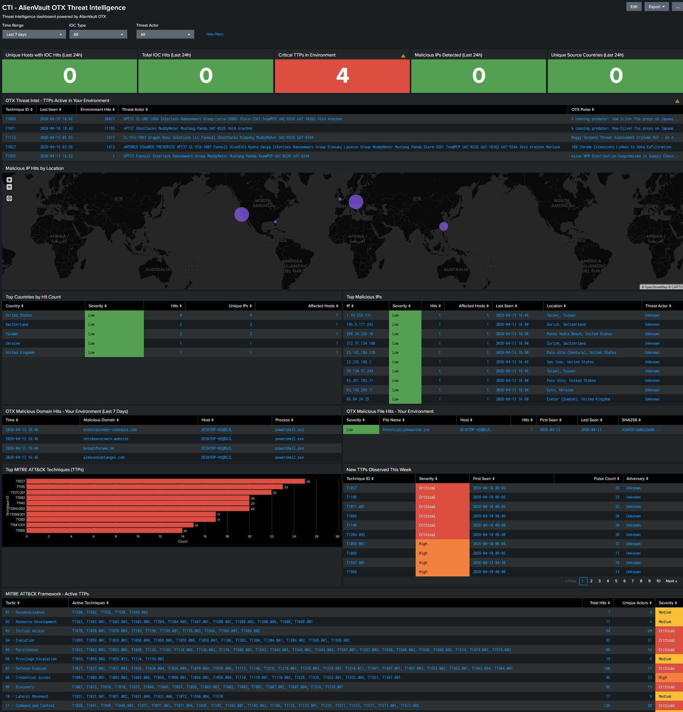

# Splunk OTX CTI Dashboard

A Splunk Classic Dashboard that correlates live AlienVault OTX threat intelligence against Sysmon endpoint telemetry to surface active threats in your environment. Built for the ECA Cyber Range Splunk Security Dashboard Challenge.

---

## Overview

This dashboard answers one core question a SOC analyst asks every shift: **is threat intelligence from the outside world actively hitting my environment right now?**

It joins live Sysmon telemetry from Windows endpoints against malicious indicators and adversary TTPs from AlienVault OTX. Surfacing not just what threats exist globally, but which ones your machines are actually talking to.


---

## Features

- **15 dashboard panels** across 8 rows covering the full CTI lifecycle
- **Live threat data** powered by AlienVault OTX via the TA-otx Splunk Add-on
- **Dynamic filters** — time range picker, IOC type dropdown, and threat actor dropdown affecting all panels simultaneously
- **IOC type filter** — selecting IPv4, domain, or hash type filters all relevant IOC panels; unrelated panels return no results
- **MITRE ATT&CK TTP tracking** — technique frequency across all 14 tactics correlated against live endpoint data
- **Geographic intelligence** — bubble map of malicious IP hits with country and IP-level drill-down tables
- **Environment correlation** — every IOC panel joins OTX indicators against Sysmon events so results reflect actual activity in your environment

---

## Dashboard Panels

| # | Panel | Type | Row | Data Source |
|---|-------|------|-----|-------------|
| 1 | Unique Hosts with IOC Hits (Last 24h) | Single Value KPI | 1 | Sysmon + OTX |
| 2 | Total IOC Hits (Last 24h) | Single Value KPI | 1 | Sysmon + OTX |
| 3 | Critical TTPs in Environment | Single Value KPI | 1 | Sysmon + OTX |
| 4 | Malicious IPs Detected (Last 24h) | Single Value KPI | 1 | Sysmon + OTX |
| 5 | Unique Source Countries (Last 24h) | Single Value KPI | 1 | Sysmon + OTX |
| 6 | OTX Threat Intel - TTPs Active in Your Environment | Table | 2 | Sysmon + OTX |
| 7 | Malicious IP Hits by Location | Bubble Map | 3 | Sysmon + OTX |
| 8 | Top Countries by Hit Count | Table | 4 | Sysmon + OTX |
| 9 | Top Malicious IPs | Table | 4 | Sysmon + OTX |
| 10 | OTX Malicious Domain Hits - Your Environment (Last 7 Days) | Table | 5 | Sysmon + OTX |
| 11 | OTX Malicious File Hits - Your Environment | Table | 5 | Sysmon + OTX |
| 12 | Top MITRE ATT&CK Techniques (TTPs) | Bar Chart | 6 | OTX |
| 13 | New TTPs Observed This Week | Table | 6 | OTX |
| 14 | MITRE ATT&CK Framework - Active TTPs | Table | 7 | OTX |
| 15 | OTX Feed Health - Last Ingest Times | Table | 8 | OTX |

---

## Security Questions Answered

| Panel | Security Question |
|-------|------------------|
| Unique Hosts with IOC Hits | How many of my machines had confirmed malicious indicator contact in the last 24 hours? |
| Total IOC Hits | How many distinct malicious indicators were seen across my environment today? |
| Critical TTPs in Environment | How many adversary techniques seen in OTX pulses are firing at high volume in my Sysmon logs? |
| Malicious IPs Detected | How many OTX-flagged IPs did my environment connect to in the last 24 hours? |
| Unique Source Countries | How many countries are malicious connections originating from? |
| TTPs Active in Environment | Which MITRE techniques are both in OTX intelligence and actively observed in my Sysmon data? |
| Malicious IP Hits by Location | Where geographically are the malicious IPs hitting my environment located? |
| Top Countries by Hit Count | Which countries are responsible for the most malicious connection attempts? |
| Top Malicious IPs | Which specific IPs are hitting my environment most frequently and who do they belong to? |
| Malicious Domain Hits | Which OTX-flagged domains are my machines resolving via DNS? |
| Malicious File Hits | Which OTX-flagged file hashes have been executed, loaded, or created on my endpoints? |
| Top MITRE ATT&CK Techniques | Which adversary techniques appear most frequently across all OTX pulses? |
| New TTPs This Week | What new adversary techniques have appeared in OTX intelligence this week? |
| MITRE ATT&CK Framework | Which of the 14 ATT&CK tactic categories have active techniques in OTX right now? |
| Feed Health | Is OTX data flowing into Splunk and how fresh is it? |

---

## Requirements

- Splunk Enterprise 9.1 or higher
- [TA-otx — Add-on for Open Threat Exchange](https://splunkbase.splunk.com/app/4336) by Luke Monahan
- AlienVault OTX account and API key — sign up free at [otx.alienvault.com](https://otx.alienvault.com)
- An index named `otx` created in Splunk
- A Sysmon-instrumented Windows host forwarding to Splunk (index: `sysmon`)

---

## Installation

### 1. Create the OTX index in Splunk
```
Settings → Indexes → New Index
Index Name: otx
Index Type: Events
```

### 2. Install the TA-otx Add-on
- Download from [Splunkbase](https://splunkbase.splunk.com/app/4336)
- Install via Apps → Manage Apps → Install from file

### 3. Configure the OTX input
- Go to Apps → TA-OTX → Configuration
- Enter your OTX API key under the Account tab
- Save proxy settings (even if disabled) to avoid credential errors
- Go to Settings → Data Inputs → OTX → Enable OTX_Feed
- Set index to `otx` and interval to `3600` (1 hour)

### 4. Import the dashboard
- Go to Settings → User Interface → Views → Create New View
- Select Dashboard (Classic) and paste the contents of `splunk-otx-cti-dashboard.xml`

### 5. Verify data is flowing
```
index=otx | stats count by sourcetype
```
You should see `otx:indicator` and `otx:pulse` with non-zero counts.

---

## Dynamic Filters

| Filter | Description |
|--------|-------------|
| Time Range | Controls the time window for all panels |
| IOC Type | Filters all IOC panels by type — selecting a type hides unrelated panels |
| Threat Actor | Filters pulse and TTP panels by attributed adversary |

---

## Sysmon Event Codes Used

| Event Code | Description | IOC Type Matched |
|------------|-------------|------------------|
| 1 | Process Create | SHA256 file hash + TTP (T1059) |
| 3 | Network Connection | Destination IP + TTP (T1071) |
| 7 | Image Loaded | SHA256 file hash |
| 8 | CreateRemoteThread | TTP (T1055) |
| 11 | File Created | SHA256 file hash + TTP (T1027) |
| 13 | Registry Value Set | TTP (T1112) |
| 22 | DNS Query | Domain + TTP (T1071) |

---

## Known Issues

- Fields with `{}` notation (e.g. `attack_ids{}`) may show a yellow warning icon in Splunk — this is cosmetic and does not affect results
- The Threat Actor dropdown only populates once OTX pulses with attributed adversaries have been ingested
- The Domain Hits panel uses a fixed 7-day window regardless of the time range picker
- The IOC Type filter does not affect TTP panels — TTP correlation is based on Sysmon event codes, not OTX indicator types
- The map requires outbound HTTPS to `basemaps.cartocdn.com` for the dark tile layer — remove the `tileLayer` options to fall back to Splunk's default tiles if air-gapped
- `iplocation` uses Splunk's bundled MaxMind GeoLite2 database — RFC1918 addresses will not resolve and are excluded from the map
- This dashboard is **Windows-only** — Linux hosts forwarding `/var/log` will not appear in any panel. Linux support would require panels built against auditd/syslog fields or normalization to Splunk's Common Information Model (CIM)
- "The Feed Health panel (OTX Feed Health — Last Ingest Times) has been removed from the final dashboard submission. This panel displays the last ingest timestamp for each OTX data source and is dependent on a fully configured and active TA-otx ingest pipeline. In environments where the ingest has not completed a full cycle the panel returns empty or stale results which misrepresents the dashboard's operational state. The panel XML is preserved in the source file and can be re-added by uncommenting the relevant row block at the bottom of splunk-otx-cti-dashboard.xml."

---

## Technical Notes

- OTX data is stored in two sourcetypes: `otx:pulse` (pulse metadata) and `otx:indicator` (individual IOCs)
- The TA-otx add-on requires OpenSSL 1.0 — on Ubuntu 24.04 install via:

```bash
wget http://archive.ubuntu.com/ubuntu/pool/main/o/openssl/libssl1.0.0_1.0.2n-1ubuntu5_amd64.deb
sudo dpkg -i libssl1.0.0_1.0.2n-1ubuntu5_amd64.deb
```

- If running Splunk on a VM, ensure the CPU type supports AVX2 (use `x86-64-v3` or higher in Proxmox)

---

## Production Considerations

This project uses the community-built **TA-otx** add-on which polls the OTX API hourly. A production CTI deployment would differ in several ways.

### Real-time indicator ingestion

In production, polling would be replaced with:

- **Splunk Enterprise Security (ES)** — native Threat Intelligence framework with real-time REST API ingestion
- **TAXII 2.1** — OTX supports TAXII and Splunk ES has a built-in client that receives indicator pushes in real time
- **STIX 2.1** — the structured data format used with TAXII, providing richer context including relationships between indicators, threat actors, and campaigns

### Indicator confidence and criticality scoring

OTX does not provide reliable criticality scores on individual indicators. This dashboard uses pulse count as a severity proxy. In production this would be replaced with commercial feeds that provide per-indicator scoring:

- **Recorded Future** — risk scores per IP, domain, and hash
- **ThreatConnect** — confidence-scored indicators with source reliability weighting
- **VirusTotal Enterprise** — detection ratios and community scores per file hash and URL

### MITRE ATT&CK tactic mapping

The framework panel uses a hardcoded `case` statement mapping technique IDs to tactics. In production this would be replaced with Splunk ES's maintained `mitre_attack_lookup`, or the community [MITRE ATT&CK App for Splunk](https://splunkbase.splunk.com/app/4617) for non-ES deployments.

### Other production improvements
- Automated indicator expiration and lifecycle management
- Multi-feed deduplication and confidence scoring
- Integration with SOAR platforms (Splunk SOAR, Palo Alto XSOAR) for automated response
- Role-based access control for sensitive threat intel

---

## Test Data

The environment correlation panels were validated using [Atomic Red Team](https://github.com/redcanaryco/atomic-red-team) by Red Canary. Tests were executed via [Invoke-AtomicRedTeam](https://github.com/redcanaryco/invoke-atomicredteam) to simulate adversary techniques mapped to MITRE ATT&CK, generating realistic Sysmon telemetry to validate the dashboard joins, correlation logic, and severity thresholds.

---

## Acknowledgements

- [AlienVault OTX](https://otx.alienvault.com) for the threat intelligence platform and API
- [Luke Monahan](https://splunkbase.splunk.com/app/4336) for the TA-otx Splunk Add-on
- [MITRE ATT&CK](https://attack.mitre.org) for the adversary technique framework
- [Red Canary](https://github.com/redcanaryco/atomic-red-team) for Atomic Red Team adversary simulation tests
- [ECA Cyber Range](https://www.skool.com/eca-cyber-range-4625/about?ref=176bfcb7a0794bdfbd3403e5ed04ac73) for the Splunk Security Dashboard Challenge

---

MIT License — see [LICENSE](LICENSE) for details.
